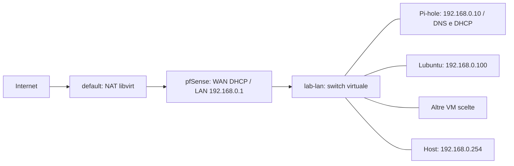

# Laboratorio pfSense, Pi-hole e Lubuntu

Le tre VM vengono **installate da zero su dischi vuoti**. I backup non vengono
usati come immagini base e non vengono cancellati dall'installer.



La rete `default` resta la WAN del firewall e continua a servire le VM esterne
al laboratorio. `lab-lan` non ha NAT, DNS o DHCP libvirt: i client usano
pfSense come gateway e Pi-hole come DNS. L'host può aprire le due interfacce web
attraverso `192.168.0.254`, senza aggiungere route manuali.

## Impostazioni recuperate dalle VM originali

Ispezione del 6 settembre 2026: dischi Linux letti offline; pfSense ispezionato
su uno snapshot temporaneo isolato, poi scartato. Le appliance originali erano
spente. Le loro NIC erano tutte sulla rete `default`, anche WAN e LAN pfSense.

| Componente | Impostazione originale |
|---|---|
| pfSense CE 2.7.2 | WAN `vtnet0` DHCP; LAN `vtnet1` `192.168.0.1/24` |
| pfSense | NAT automatico; DHCP LAN **disabilitato** |
| pfSense | DNS di sistema `192.168.0.10`, Unbound abilitato |
| Regola attiva LAN | Blocca TCP da qualunque sorgente verso `192.168.1.50:22` |
| Regola di prova **disabilitata** | Blocca TCP da `192.168.0.220` verso qualunque destinazione |
| Regole successive | Permetti LAN verso qualunque destinazione, IPv4 e IPv6 |
| Pi-hole v5 su Ubuntu 22.04.5 | `192.168.0.10/24`, gateway `192.168.0.1`, DHCP **disabilitato** |
| DNS upstream Pi-hole | OpenDNS `208.67.222.222`, `208.67.220.220` |
| Pi-hole | 18 record locali, 3 CNAME; sola lista StevenBlack; nessuna whitelist/blacklist aggiuntiva |
| Lubuntu 22.04.5 | IP statico `192.168.0.100/24`, gateway `.1`, DNS `.10` |

L'ultima lease DHCP salvata in Lubuntu apparteneva a una configurazione
precedente: il profilo NetworkManager effettivo era statico.

I file versionati che descrivono queste personalizzazioni sono in
[`network-lab/`](../network-lab/):

- `profile.json`: indirizzi, topologia e pool DHCP del nuovo laboratorio;
- `pfsense-network.xml`: sezioni di rete e regole, con ordine e stato conservati;
- `pfsense-base.xml`: base senza vecchie password, certificati o chiavi private;
- `pihole-custom.list`, `pihole-cname.conf`, `pihole-adlists.list`: record e lista DNS;
- `pfsense-installerconfig`, `pfsense-rc.local`, `pihole-firstboot.sh`: automazione.

## Differenze intenzionali nella nuova installazione

- WAN e LAN pfSense sono su switch diversi.
- Pi-hole **v6** viene installato dall'installer ufficiale, con le impostazioni
  migrate in TOML. Il risultato verificato è Core 6.4.3, Web 6.6, FTL 6.7.
- Pi-hole distribuisce DHCP da `.150` a `.199`, gateway `.1`, DNS `.10`, dominio
  `qlan`. Il pool evita gli indirizzi statici recuperati. Si può disabilitare
  con `dhcp.enabled: false` nel profilo, prima dell'installazione.
- pfSense usa l'ISO CE **2.7.2 disponibile localmente**, con filesystem ZFS.
  L'automazione è specifica di questo installer offline; il Netgate Installer
  e ISO di versioni diverse non sono automaticamente intercambiabili.
- Checksum offload VirtIO disabilitato in pfSense; console seriale abilitata.
- Gli account usano `VM_USER`, `VM_PASS`, `VM_PASS_HASH` di `scripts/lab.env`.
  pfSense ha l'utente amministrativo `VM_USER` oltre all'account integrato
  `admin`, entrambi con `VM_PASS`. Anche la password web Pi-hole usa `VM_PASS`.
- Linux parte da Ubuntu Server 22.04.5; Lubuntu aggiunge `lubuntu-desktop`,
  guest agent, Spice e Arc theme, con autologin. File personali e cronologie
  delle VM precedenti non vengono trasferiti nella nuova installazione.

## Installazione

Prerequisiti aggiuntivi: `python3-yaml`, `python3-bcrypt`, `dvd+rw-tools`.
Sono inclusi in `make setup`. Servono queste ISO in `$VM_BASE_DIR/storage/Iso/Distro`:

```text
pfSense-CE-2.7.2-RELEASE-amd64.iso
ubuntu-22.04.5-live-server-amd64.iso
```

```bash
make network-plan           # anteprima, senza modificare libvirt
make network-install        # LAN + tre installazioni, interamente automatiche

# Oppure, separatamente:
make network-up
make pfsense
make pihole
make lab-lubuntu22
```

`make lab-lubuntu22` crea **lubuntu22**, il client di questo laboratorio.
`make lubuntu22` resta il profilo desktop generico preesistente **lubuntu22.04**.

Gli installer rifiutano VM o dischi finali già esistenti. I nuovi dischi si
chiamano `<nome>-unattended.qcow2`: non sovrascrivono quelli storici.
Per rigenerare occorre prima salvare quanto interessa e rimuovere esplicitamente
la nuova VM/disco. Le ISO generate vengono rigenerate solo se non sono collegate
ad altre VM. Non esiste una cancellazione implicita
rispondendo `S`, neppure con `reinstall-<id>`.

Le ISO generate contengono credenziali di provisioning: sono locali, con
permessi ristretti, e non vengono versionate. Per generare solo una ISO:
`make iso-pfsense`, `make iso-pihole`, `make iso-lab-lubuntu22`.

Linux si installa temporaneamente su `default`, così non dipende da un DNS
ancora in costruzione. Il DHCP di Pi-hole rimane spento durante questa fase.
Dopo il bootstrap, lo script prepara la rete statica, impedisce a cloud-init
di riscriverla, spegne la VM, sposta l'unica NIC sulla LAN e la riavvia.

L'installazione pfSense segnala il completamento sul log seriale
`storage/hd/pfSense-install.serial.log`. Il bootstrap Pi-hole scrive
`/var/log/kvm-lab-pihole.log` nel guest. Gli errori interrompono l'orchestrazione;
una VM semplicemente avviata non viene considerata un'installazione riuscita.

## Collegare altre VM

```bash
bash scripts/network-lab.sh attach NOME_VM   # anteprima, VM spenta
make network-attach VM=NOME_VM              # applica e salva l'XML precedente
```

Il collegamento richiede una sola NIC, conserva MAC e modello e cambia il suo
switch. Nel guest scegliere DHCP, oppure un IP statico libero con gateway `.1`
e DNS `.10`. Gli IP statici vanno tenuti fuori dal pool `.150`–`.199`.
Le VM rimaste su `default` continuano a usare la rete precedente.

Il backup della definizione è in `.local/network-backups/`; il comando stampa
la riga `virsh define` per ripristinarla. Non cambia automaticamente i profili
di rete dentro un client esistente.

## Backup e ripristino

```bash
make network-backup       # richiede tutte e tre le VM spente
```

Crea una cartella nuova in `storage/backups/network-lab/` con dischi completi,
snapshot interni, definizioni XML, metadati snapshot e un `manifest.json`.
Verifica ogni qcow2 e confronta SHA-256 tra sorgente e copia. Il manifest viene
scritto solo dopo il completamento di tutte le verifiche.

Il backup iniziale `20260906T003223Z-d4650c` è stato verificato e poi
eliminato su richiesta dell'utente, dopo l'approvazione delle nuove VM.
Nessun target elimina automaticamente i backup futuri.

I vecchi dischi originali sono ancora conservati. Per un rollback da un
backup disponibile: spegnere e salvare le nuove VM, liberare i loro
nomi libvirt, ripristinare i dischi dal backup ai percorsi indicati negli XML
se necessario, quindi usare `virsh -c qemu:///system define <backup>/<ruolo>.xml`.
I metadati snapshot si ripristinano con `virsh snapshot-create <VM> <snapshot.xml>
--redefine`. Il rollback ripristina anche la vecchia topologia su `default`.

Per riapplicare soltanto le regole a una futura installazione pfSense, partendo
dal suo backup completo e conservandone gli account:

```bash
python3 scripts/lab-network.py pfsense-config \
  --base /percorso/backup-nuovo.xml --output /percorso/config-da-ripristinare.xml
```

Il risultato va ripristinato dalla GUI pfSense. Lo script rimpiazza le sezioni
di rete; usare una nuova installazione, non un firewall con altre LAN da mantenere.

## Avvio lento di Lubuntu (risolto)

La base Ubuntu Server abilita `systemd-networkd-wait-online`. Quando la fase finale
dell'installer sostituisce il netplan con `01-lab.yaml` (renderer NetworkManager,
IP statico), networkd non gestisce più nessun link e wait-online resta in attesa
fino al timeout di 120 s, poi fallisce: il boot durava oltre 2 minuti con
`A start job is running for Wait for Network to be Configured` in console.
Dal 6 settembre 2026 `finalize_script()` in `scripts/install-network-vm.py`
disabilita wait-online, `systemd-networkd.service` e il suo socket sul solo ruolo
lubuntu (Pi-hole resta su networkd). Su una VM già installata basta:

```bash
sudo systemctl disable --now systemd-networkd-wait-online.service systemd-networkd.service systemd-networkd.socket
```

## Verifiche eseguite sulle nuove VM

| Controllo | Risultato |
|---|---|
| Installazione pfSense su disco vuoto | ZFS, completamento segnalato dall'installer, avvio da disco riuscito |
| Login GUI pfSense con `VM_USER` | Riuscito; regole e stato disabilitato confrontati con il backup recuperato |
| Routing Lubuntu dopo riavvio | Solo `192.168.0.100/24`, gateway `192.168.0.1` |
| DNS locale | `pfsense.qlan` → `firewall.qlan` → `192.168.0.1` |
| DNS pubblico e HTTPS da Lubuntu | Risoluzione riuscita; risposta HTTP 200 da `https://example.org` |
| DHCP DISCOVER/REQUEST di prova | ACK `.182`, server `.10`, gateway `.1`, DNS `.10`; lease poi rilasciata |
| Desktop Lubuntu | Sessione utente, LXQt panel e Openbox attivi; autologin riuscito |
| Boot Lubuntu | 6,7 s (`systemd-analyze`); prima del fix 2 min 8 s, spesi in `systemd-networkd-wait-online` |
| Test locali e CI | 9 test delle configurazioni, registro VM, sintassi Python/Bash e ShellCheck |

I test delle configurazioni non avviano né reinstallano VM:

```bash
python3 -m unittest discover -s tests -p 'test_network_lab.py'
```

## Riferimenti

- [Reti isolate e DNS libvirt](https://libvirt.org/formatnetwork.html)
- [Configurazione XML pfSense](https://docs.netgate.com/pfsense/en/latest/config/xml-configuration-file.html)
- [VirtIO in pfSense](https://docs.netgate.com/pfsense/en/latest/virtualization/virtio.html)
- [Configurazione Pi-hole v6](https://docs.pi-hole.net/ftldns/configfile/)

Il supporto scripted/ZFS è stato verificato direttamente negli script
`/etc/rc.local` e `/usr/libexec/bsdinstall/script` dell'ISO locale pfSense 2.7.2.
